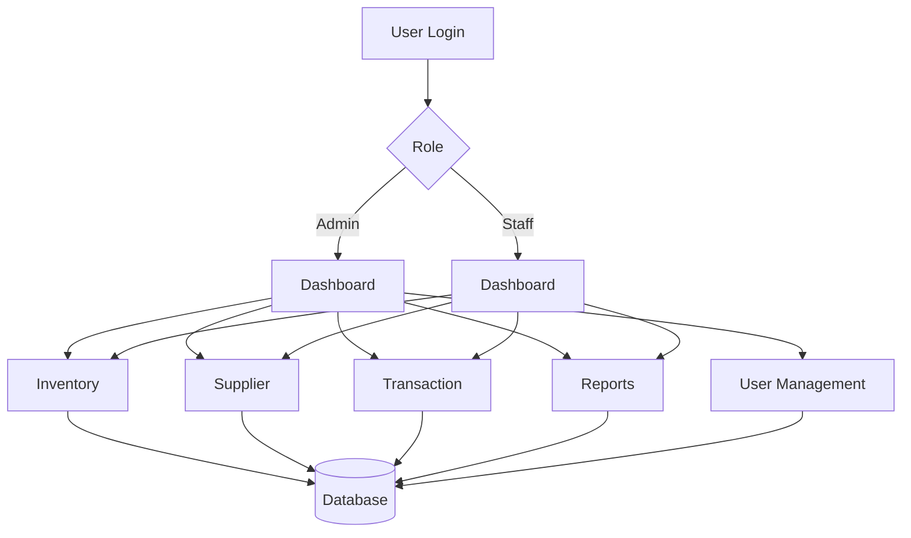
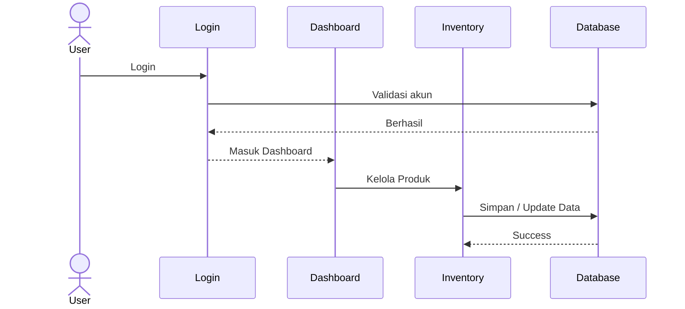

<div align="center">

# 📦 Supply Management System

### *Web-Based Supply Chain & Inventory Management System*

[](https://www.php.net/)
[](https://www.mysql.com/)
[](https://tailwindcss.com/)
[](https://developer.mozilla.org/en-US/docs/Web/JavaScript)
[]()

Sistem informasi berbasis web yang dirancang untuk membantu proses **pengelolaan persediaan (inventory)**, **supplier**, dan **transaksi pembelian** secara terintegrasi, efisien, dan aman.

</div>

---

# 📖 Tentang Proyek

**Supply Management System** merupakan aplikasi berbasis web yang dikembangkan untuk mendukung proses pengelolaan rantai pasok (*Supply Chain Management*) secara terkomputerisasi.

Sistem ini menggantikan proses pencatatan manual dengan solusi digital yang mampu meningkatkan **akurasi data**, **kecepatan proses**, dan **efisiensi operasional**.

Melalui aplikasi ini, pengguna dapat mengelola data produk, supplier, transaksi pembelian, pengguna sistem, serta laporan dalam satu platform yang terintegrasi.

Selain itu, sistem menerapkan **Role-Based Access Control (RBAC)** sehingga setiap pengguna hanya dapat mengakses fitur sesuai dengan hak akses yang dimiliki.

---

# 🎯 Tujuan Pengembangan

Pengembangan sistem ini bertujuan untuk:

- 📦 Mengelola data persediaan secara terstruktur
- 📉 Mengurangi kesalahan pencatatan stok dan transaksi
- 🏢 Mempermudah pengelolaan supplier
- 📑 Menyediakan laporan yang akurat
- ⚡ Meningkatkan efisiensi proses bisnis
- 🔒 Menjaga keamanan data melalui sistem hak akses

---

# ✨ Fitur Utama

| Modul | Deskripsi |
|--------|-----------|
| 🔐 Authentication | Login, Session Management, Role-Based Access Control |
| 📊 Dashboard | Ringkasan data inventory, supplier, dan transaksi |
| 📦 Inventory | CRUD Produk, kategori, stok, lokasi penyimpanan |
| 🏢 Supplier | CRUD Supplier dan relasi produk |
| 🛒 Transaction | Purchase Order, Invoice, Pembayaran |
| 👥 User Management | Manajemen akun, role, dan activity log |
| ⚙️ Settings | Profil pengguna dan perubahan password |
| 📑 Reports | Laporan inventory, supplier, transaksi, dan aktivitas |

---

# 🏗️ Arsitektur Sistem



---

# 🛠️ Teknologi yang Digunakan

## Frontend

- HTML5
- Tailwind CSS
- JavaScript

## Backend

- PHP Native
- MySQL

---

# 📂 Struktur Project

```text
Supply-Management-System/
│
├── assets/
│
├── config/
│   └── database.php
│
├── controllers/
│
├── models/
│
├── views/
│
├── public/
│
├── database/
│
├── index.php
│
└── README.md
```

---

# ⚙️ Konfigurasi Database

Lokasi konfigurasi database:

```text
config/database.php
```

Contoh konfigurasi:

```php
$host = "localhost";
$user = "root";
$pass = "";
$db   = "supply_management";

$conn = mysqli_connect($host, $user, $pass, $db);
```

---

# 🚀 Cara Menjalankan Aplikasi

### 1️⃣ Clone Repository

```bash
git clone https://github.com/username/supply-management-system.git
```

---

### 2️⃣ Pindahkan Project

Salin project ke folder web server:

- XAMPP → `htdocs`
- Laragon → `www`

---

### 3️⃣ Jalankan Server

Aktifkan:

- Apache
- MySQL

---

### 4️⃣ Import Database

Import file SQL ke MySQL melalui phpMyAdmin.

---

### 5️⃣ Konfigurasi Database

Sesuaikan file:

```text
config/database.php
```

---

### 6️⃣ Jalankan Aplikasi

Buka browser:

```text
http://localhost/supply-management-system
```

---

### 7️⃣ Login

Masukkan akun yang tersedia pada database.

---

# 🔐 Hak Akses

| Role | Hak Akses |
|------|-----------|
| 👑 Admin | Mengakses seluruh fitur sistem |
| 👨‍💼 Staff | Mengelola data sesuai hak akses yang diberikan |

---

# 📊 Alur Sistem



---

# 📸 Tampilan Aplikasi

## 🏠 Dashboard

```
assets/dashboard.png
```


---

## 📦 Inventory

```
assets/inventory.png
```


---

## 🏢 Supplier

```
assets/supplier.png
```


---

## 🛒 Transaction

```
assets/transaction.png
```


---

## 📑 Reports

```
assets/report.png
```


---

# 📌 Status Fitur

| Fitur | Status |
|--------|:------:|
| Login | ✅ |
| Dashboard | ✅ |
| Inventory Management | ✅ |
| Supplier Management | ✅ |
| Purchase Transaction | ✅ |
| Reports | ✅ |
| User Management | ✅ |
| Settings | ✅ |

---

# 🚀 Rencana Pengembangan

Beberapa fitur yang akan dikembangkan pada versi berikutnya:

- 📱 Responsive Mobile Version
- 📦 Barcode / QR Code Scanner
- 📊 Dashboard Analytics
- 📈 Grafik Statistik
- 📧 Email Notification
- 🔔 Low Stock Notification
- 📤 Export PDF & Excel
- 🌐 REST API
- ☁️ Cloud Database Integration
- 🏭 Multi Warehouse Management

---

# 👥 Tim Pengembang

| Nama | NIM |
|------|------------|
| **Asyraf Almuzaki** | 24051204081 |
| **Jonathan** | 24051204087 |
| **Firman Nova Prayoga** | 24051204088 |
| **Fawwaz Baghiz Al Ghozy Dinullah** | 24051204094 |

---

# 🎓 Tujuan Proyek

Proyek ini dikembangkan sebagai bagian dari pembelajaran mata kuliah **Sistem Informasi** dan bertujuan untuk mengimplementasikan konsep:

- Supply Chain Management
- Inventory Management
- Database Management
- Role-Based Access Control
- Web Development
- CRUD Application

---

# 📜 Lisensi

Proyek ini dibuat untuk **keperluan pembelajaran** dan **pengembangan akademik**.

---

<div align="center">

### ⭐ Jika proyek ini bermanfaat, jangan lupa berikan Star!

**Developed with ❤️ by Team Supply Management System**

</div>
